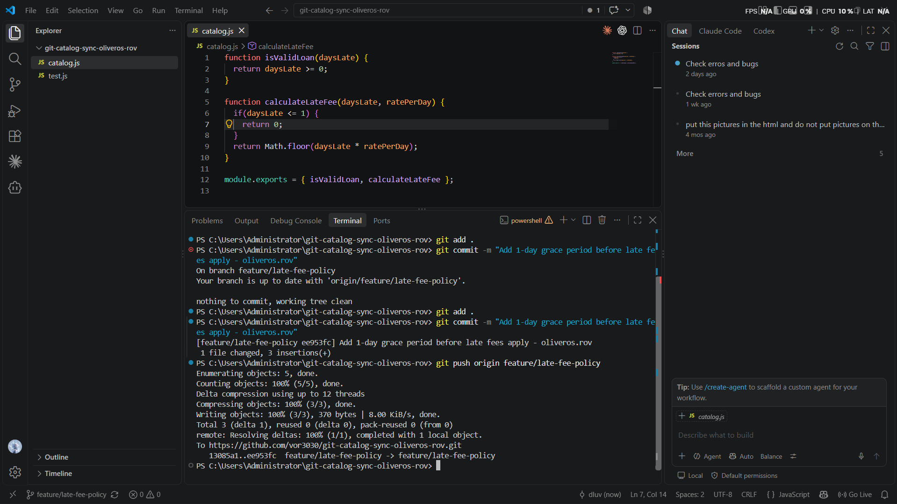
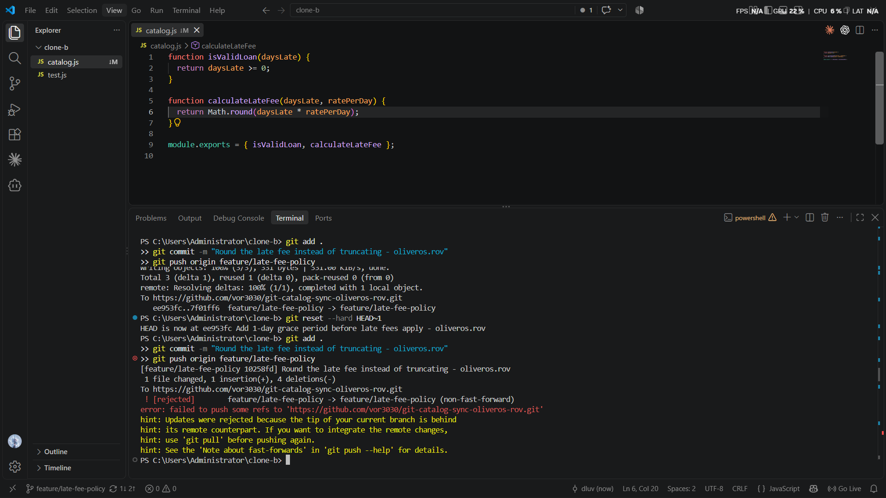
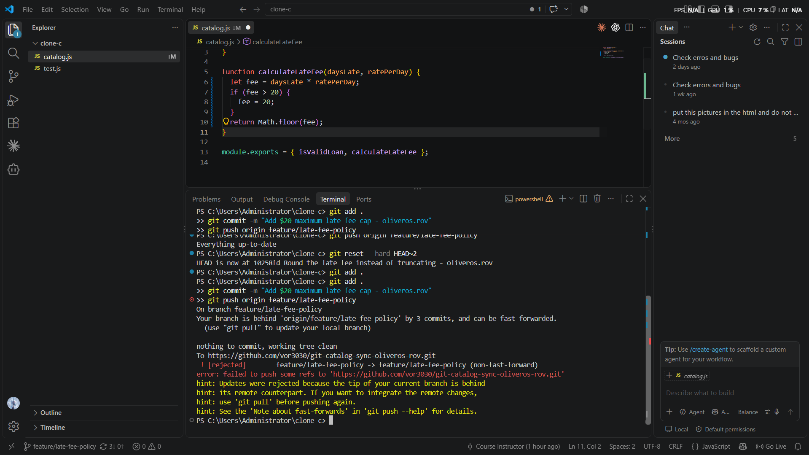
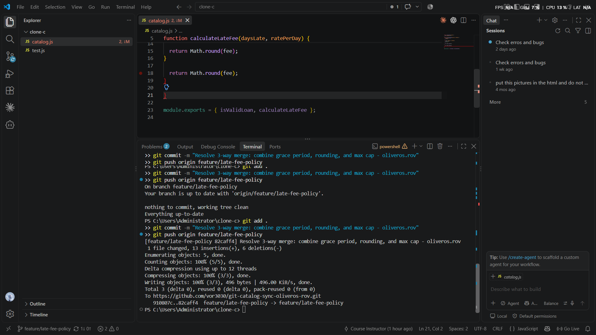
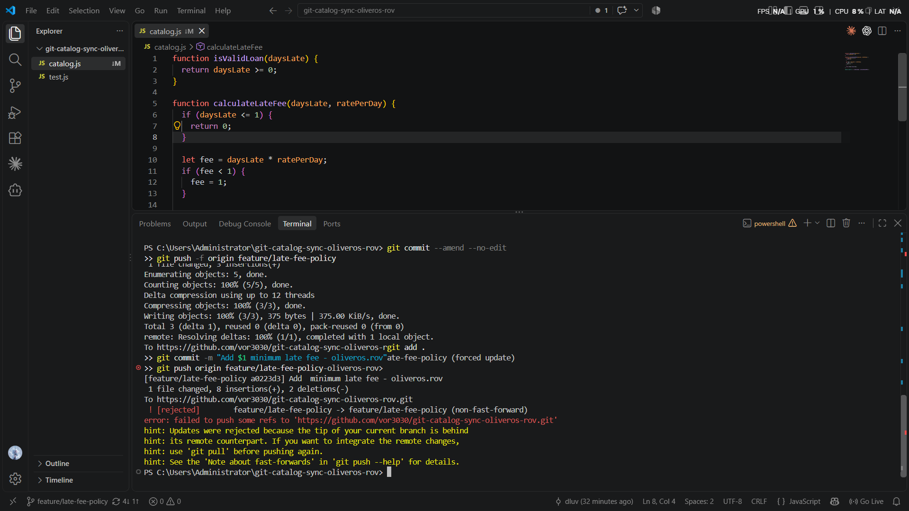
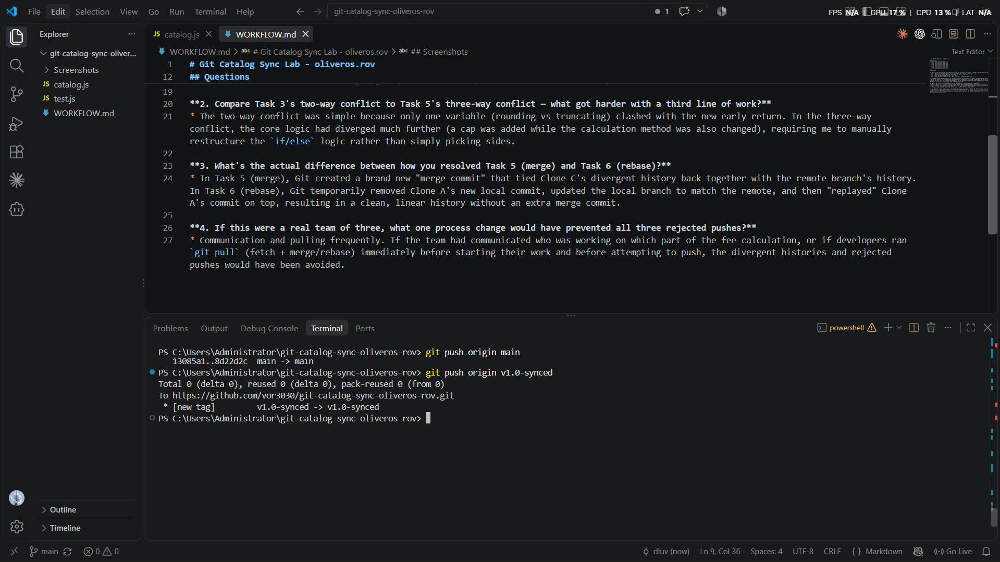

# Git Catalog Sync Lab - oliveros.rov

## Screenshots
1. 
2. 
3. 
4. 
5. 
6. 
7. 

## Questions

**1. Walk through the final calculateLateFee function and name which contributor's change is responsible for each part.**
* Clone A added the 1-day grace period at the very top of the function (`daysLate <= 1`). 
* Clone A (during Task 6) also added the minimum $1 fee logic (`fee < 1`).
* Clone C added the maximum $20 fee cap (`fee > 20`).
* Clone B added the final rounding logic (`Math.round(fee)` instead of `Math.floor`).

**2. Compare Task 3's two-way conflict to Task 5's three-way conflict — what got harder with a third line of work?**
* The two-way conflict was simple because only one variable (rounding vs truncating) clashed with the new early return. In the three-way conflict, the core logic had diverged much further (a cap was added while the calculation method was also changed), requiring me to manually restructure the `if/else` logic rather than simply picking sides. 

**3. What's the actual difference between how you resolved Task 5 (merge) and Task 6 (rebase)?**
* In Task 5 (merge), Git created a brand new "merge commit" that tied Clone C's divergent history back together with the remote branch's history. In Task 6 (rebase), Git temporarily removed Clone A's new local commit, updated the local branch to match the remote, and then "replayed" Clone A's commit on top, resulting in a clean, linear history without an extra merge commit.

**4. If this were a real team of three, what one process change would have prevented all three rejected pushes?**
* Communication and pulling frequently. If the team had communicated who was working on which part of the fee calculation, or if developers ran `git pull` (fetch + merge/rebase) immediately before starting their work and before attempting to push, the divergent histories and rejected pushes would have been avoided.